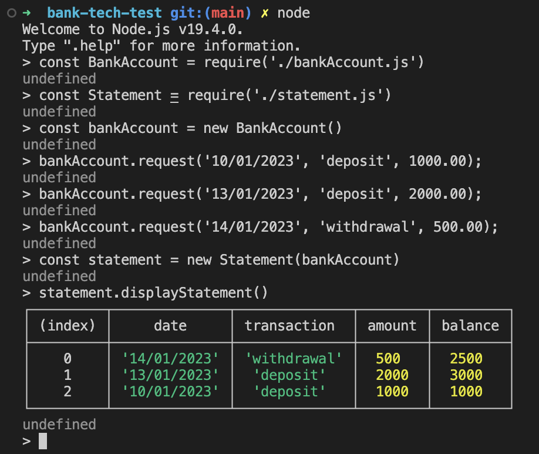

# Bank Tech Test

An application that displays the deposits, withdrawal of account statment, built with JavaScript. User is able to interact with their code via Read-Eval-Print Loop (REPL) node. It captures the user's JavaScript code inputs, interprets, and evaluates the result of the code. It displays the result to the screen.

## Installation and Setup Instructions

Clone down this repository. You will need `node` and `npm` installed globally on your machine.  
Installation:

```
 ; cd back-tech-test
 ; npm install
```

To Run Test Suite:

You will need to install `jest` before you are able run the test suite:

```
 ; npm init -y
 ; npm add jest
 ; npm install -g jest

 # Run the tests
 ; jest
```

## Running The Project via Command Line
```
; node
> Welcome to Node.js v19.4.0.
  Type ".help" for more information.
; const BankAccount = require('./bankAccount.js')
; const Statement = require('./statement.js')
; const bankAccount = new BankAccount()
; bankAccount.request('10/01/2023', 'deposit', 1000.00);
; bankAccount.request('13/01/2023', 'deposit', 2000.00);
; bankAccount.request('14/01/2023', 'withdrawal', 500.00);
; const statement = new Statement(bankAccount)
; statement.displayStatement()
```
## Screen Shot of Running the App and the Output


## Purpose of Bank-tech-test
Learning Objective:

- Improving design and TDD skills through individual practice
- Reviewing my own code so I can practice reflecting and improving my own work

# Specification

Requirements
You should be able to interact with your code via a REPL like IRB or Node.
(You don't need to implement a command line interface that takes input from STDIN.)
Deposits, withdrawal.
Account statement (date, amount, balance) printing.
Data can be kept in memory (it doesn't need to be stored to a database or anything).
Acceptance criteria
Given a client makes a deposit of 1000 on 10-01-2023
And a deposit of 2000 on 13-01-2023
And a withdrawal of 500 on 14-01-2023
When she prints her bank statement
Then she would see

| date       | credit   | debit   | balance |
| ---------- | -------- | ------- | ------- |
| 14/01/2023 | -------- | 500.00  | 2500.00 |
| 13/01/2023 | 2000.00  | ------- | 3000.00 |
| 10/01/2023 | 1000.00  | ------- | 1000.00 |
